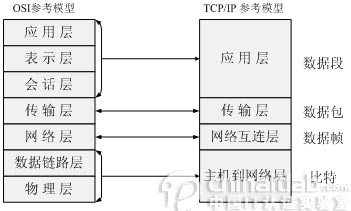

## 1.1OSI/ISO模型、TCP/IP模型、五层模型

** 层次结构 **

五层模型中，数据链路层和物理层不分开。

| 层次                 | 功能                                             | 协议                                          | 传输单元       | 中继器                           |
| -------------------- | ------------------------------------------------ | --------------------------------------------- | -------------- | -------------------------------- |
| 应用层               | 进程交互                                         | HTTP                                          | 报文           | 网关                             |
| 传输层               |                                                  | TCP                                           | 报文段         | 网关                             |
|                      |                                                  | UDP                                           | 用户数据报     | 网关                             |
| 网络层/ 网际层/ IP层 | 异构网络互联、路由与转发、拥塞控制               | 网际协议IP、ICMP、IGMP、ARP、多种路由选择协议 | 分组(IP数据报) | 路由器                           |
| 数据链路层           | 封装成帧、透明传输、差错控制、流量控制、可靠传输 | PPP                                           | 帧（frame）    | 网桥、以太网交换机（多接口网桥） |
| 物理层               |                                                  |                                               | 比特           | 集线器、转发器、中继器           |
